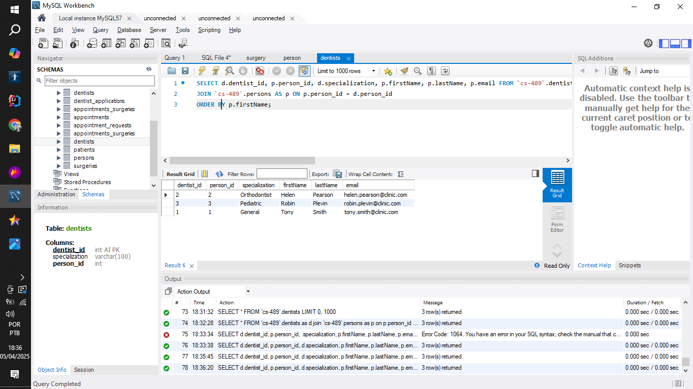
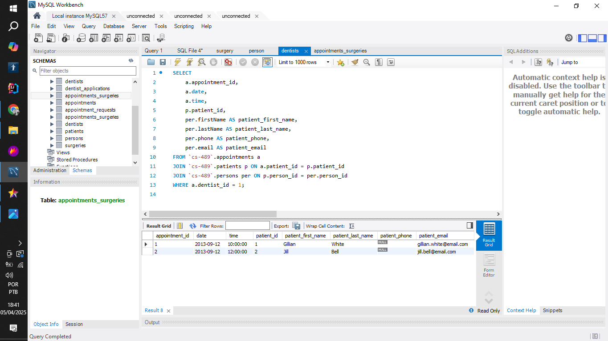
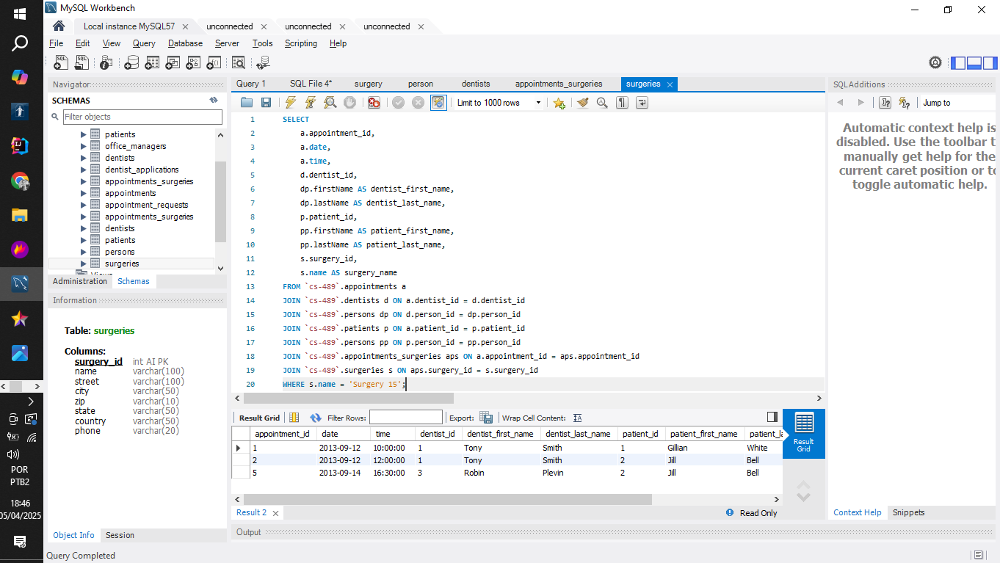
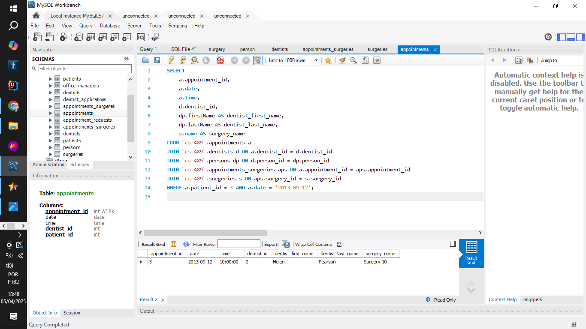

# Lab 5

CS-489

## Raul Souto

In this project you'll find the deliverable:

1. ER model diagram.
2. 'screenshots' folder with all images required.
3. myADSDentalSurgeryDBScript.sql file.

### Modeling the Database


The following scripts are found at [myADSDentalSurgeryDBScript.sql](myADSDentalSurgeryDBScript.sql) file.

### Creation of the Database

```sql
--TABLE CREATION
-- Table: persons
CREATE TABLE `persons` (
  `person_id` INT NOT NULL AUTO_INCREMENT,
  `firstName` VARCHAR(45) NOT NULL,
  `lastName` VARCHAR(45) NOT NULL,
  `phone` VARCHAR(15),
  `email` VARCHAR(100),
  PRIMARY KEY (`person_id`)
);

-- Table: patients
CREATE TABLE `patients` (
  `patient_id` INT NOT NULL AUTO_INCREMENT,
  `dateOfBirth` DATE NOT NULL,
  `street` VARCHAR(100),
  `city` VARCHAR(50),
  `zip` VARCHAR(10),
  `state` VARCHAR(50),
  `country` VARCHAR(50),
  `person_id` INT NOT NULL,
  PRIMARY KEY (`patient_id`),
  FOREIGN KEY (`person_id`) REFERENCES `persons`(`person_id`)
);

-- Table: dentists
CREATE TABLE `dentists` (
  `dentist_id` INT NOT NULL AUTO_INCREMENT,
  `specialization` VARCHAR(100),
  `person_id` INT,
  PRIMARY KEY (`dentist_id`),
  FOREIGN KEY (`person_id`) REFERENCES `persons`(`person_id`)
);

-- Table: office_managers
CREATE TABLE `office_managers` (
  `office_manager_id` INT NOT NULL AUTO_INCREMENT,
  `person_id` INT NOT NULL,
  PRIMARY KEY (`office_manager_id`),
  FOREIGN KEY (`person_id`) REFERENCES `persons`(`person_id`)
);

-- Table: appointments
CREATE TABLE `appointments` (
  `appointment_id` INT NOT NULL AUTO_INCREMENT,
  `date` DATE NOT NULL,
  `time` TIME NOT NULL,
  `dentist_id` INT NOT NULL,
  `patient_id` INT NOT NULL,
  PRIMARY KEY (`appointment_id`),
  FOREIGN KEY (`dentist_id`) REFERENCES `dentists`(`dentist_id`),
  FOREIGN KEY (`patient_id`) REFERENCES `patients`(`patient_id`)
);

-- Table: surgeries
CREATE TABLE `surgeries` (
  `surgery_id` INT NOT NULL AUTO_INCREMENT,
  `name` VARCHAR(100),
  `street` VARCHAR(100),
  `city` VARCHAR(50),
  `zip` VARCHAR(10),
  `state` VARCHAR(50),
  `country` VARCHAR(50),
  `phone` VARCHAR(20),
  PRIMARY KEY (`surgery_id`)
);

-- Table: appointments_surgeries (join table)
CREATE TABLE `appointments_surgeries` (
  `app_sur_id` INT NOT NULL AUTO_INCREMENT,
  `appointment_id` INT NOT NULL,
  `surgery_id` INT NOT NULL,
  PRIMARY KEY (`app_sur_id`),
  FOREIGN KEY (`appointment_id`) REFERENCES `appointments`(`appointment_id`),
  FOREIGN KEY (`surgery_id`) REFERENCES `surgeries`(`surgery_id`)
);

-- Table: appointment_requests
CREATE TABLE `appointment_requests` (
  `app_req_id` INT NOT NULL AUTO_INCREMENT,
  `date` DATE,
  `time` TIME,
  `location` VARCHAR(100),
  `patient_id` INT NOT NULL,
  PRIMARY KEY (`app_req_id`),
  FOREIGN KEY (`patient_id`) REFERENCES `patients`(`patient_id`)
);

-- Table: dentist_applications
CREATE TABLE `dentist_applications` (
  `dent_app_id` INT NOT NULL AUTO_INCREMENT,
  `firstName` VARCHAR(45),
  `lastName` VARCHAR(45),
  `phoneNumber` VARCHAR(15),
  `specialization` VARCHAR(100),
  PRIMARY KEY (`dent_app_id`)
);
```

### Table Population

```sql
--TABLE POPULATION

-- Insert into persons (dentists + patients)
INSERT INTO `persons` (firstName, lastName, phone, email) VALUES
('Tony', 'Smith', NULL, 'tony.smith@clinic.com'),
('Helen', 'Pearson', NULL, 'helen.pearson@clinic.com'),
('Robin', 'Plevin', NULL, 'robin.plevin@clinic.com'),
('Gillian', 'White', NULL, 'gillian.white@email.com'),
('Jill', 'Bell', NULL, 'jill.bell@email.com'),
('Ian', 'MacKay', NULL, 'ian.mackay@email.com'),
('John', 'Walker', NULL, 'john.walker@email.com');

-- Insert into dentists
INSERT INTO `dentists` (specialization, person_id) VALUES
('General', 1),
('Orthodontist', 2),
('Pediatric', 3);

-- Insert into patients
INSERT INTO `patients` (dateOfBirth, street, city, zip, state, country, person_id) VALUES
('1985-01-01', '123 A St', 'Charlotte', '28201', 'NC', 'USA', 4), -- Gillian
('1990-02-02', '456 B St', 'Charlotte', '28202', 'NC', 'USA', 5), -- Jill
('1995-03-03', '789 C St', 'Charlotte', '28203', 'NC', 'USA', 6), -- Ian
('1998-04-04', '321 D St', 'Charlotte', '28204', 'NC', 'USA', 7); -- John

-- Insert into surgeries
INSERT INTO `surgeries` (name, street, city, zip, state, country, phone) VALUES
('Surgery 10', '10 Dental St', 'Charlotte', '28210', 'NC', 'USA', '111-111-1010'),
('Surgery 13', '13 Dental St', 'Charlotte', '28213', 'NC', 'USA', '111-111-1313'),
('Surgery 15', '15 Dental St', 'Charlotte', '28215', 'NC', 'USA', '111-111-1515');

-- Insert into appointments
INSERT INTO `appointments` (date, time, dentist_id, patient_id) VALUES
('2013-09-12', '10:00:00', 1, 1), -- Tony Smith & Gillian White
('2013-09-12', '12:00:00', 1, 2), -- Tony Smith & Jill Bell
('2013-09-12', '10:00:00', 2, 3), -- Helen Pearson & Ian MacKay
('2013-09-14', '14:00:00', 2, 3), -- Helen Pearson & Ian MacKay
('2013-09-14', '16:30:00', 3, 2), -- Robin Plevin & Jill Bell
('2013-09-15', '18:00:00', 3, 4); -- Robin Plevin & John Walker

-- Insert into appointments_surgeries based on actual IDs
INSERT INTO `appointments_surgeries` (appointment_id, surgery_id) VALUES
(1, 3), -- 12-Sep-13 10:00: Tony Smith & Gillian White @ S15
(2, 3), -- 12-Sep-13 12:00: Tony Smith & Jill Bell @ S15
(3, 1), -- 12-Sep-13 10:00: Helen Pearson & Ian MacKay @ S10
(4, 1), -- 14-Sep-13 14:00: Helen Pearson & Ian MacKay @ S10
(5, 3), -- 14-Sep-13 16:30: Robin Plevin & Jill Bell @ S15
(6, 2); -- 15-Sep-13 18:00: Robin Plevin & John Walker @ S13
```

### Queries

#### 1 - Display the list of ALL Dentists registered in the system, sorted in ascending: order of their lastNames:

```sql
SELECT d.dentist_id, p.person_id, d.specialization, p.firstName, p.lastName, p.email FROM `cs-489`.dentists AS d
JOIN `cs-489`.persons AS p ON p.person_id = d.person_id
ORDER BY p.firstName;
```



#### 2 - Display the list of ALL Appointments for a given Dentist by their dentist_Id number. Include in the result, the Patient information:

```sql
SELECT d.dentist_id, p.person_id, d.specialization, p.firstName, p.lastName, p.email FROM `cs-489`.dentists AS d
JOIN `cs-489`.persons AS p ON p.person_id = d.person_id
ORDER BY p.firstName;

SELECT
    a.appointment_id,
    a.date,
    a.time,
    p.patient_id,
    per.firstName AS patient_first_name,
    per.lastName AS patient_last_name,
    per.phone AS patient_phone,
    per.email AS patient_email
FROM `cs-489`.appointments a
JOIN `cs-489`.patients p ON a.patient_id = p.patient_id
JOIN `cs-489`.persons per ON p.person_id = per.person_id
WHERE a.dentist_id = 1;
```



#### 3 - Display the list of ALL Appointments that have been scheduled at a Surgery Location:

```sql
SELECT
    a.appointment_id,
    a.date,
    a.time,
    d.dentist_id,
    dp.firstName AS dentist_first_name,
    dp.lastName AS dentist_last_name,
    p.patient_id,
    pp.firstName AS patient_first_name,
    pp.lastName AS patient_last_name,
    s.surgery_id,
    s.name AS surgery_name
FROM `cs-489`.appointments a
JOIN `cs-489`.dentists d ON a.dentist_id = d.dentist_id
JOIN `cs-489`.persons dp ON d.person_id = dp.person_id
JOIN `cs-489`.patients p ON a.patient_id = p.patient_id
JOIN `cs-489`.persons pp ON p.person_id = pp.person_id
JOIN `cs-489`.appointments_surgeries aps ON a.appointment_id = aps.appointment_id
JOIN `cs-489`.surgeries s ON aps.surgery_id = s.surgery_id
WHERE s.name = 'Surgery 15';
```



#### 4 - Display the list of the Appointments booked for a given Patient on a given Date:

```sql
SELECT
    a.appointment_id,
    a.date,
    a.time,
    d.dentist_id,
    dp.firstName AS dentist_first_name,
    dp.lastName AS dentist_last_name,
    s.name AS surgery_name
FROM `cs-489`.appointments a
JOIN `cs-489`.dentists d ON a.dentist_id = d.dentist_id
JOIN `cs-489`.persons dp ON d.person_id = dp.person_id
JOIN `cs-489`.appointments_surgeries aps ON a.appointment_id = aps.appointment_id
JOIN `cs-489`.surgeries s ON aps.surgery_id = s.surgery_id
WHERE a.patient_id = 3 AND a.date = '2013-09-12';
```


